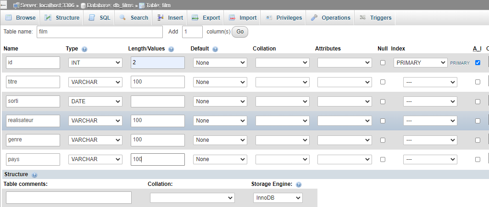
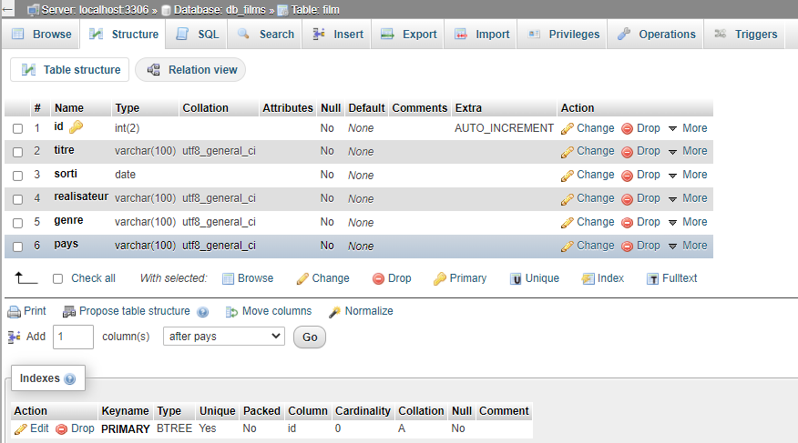
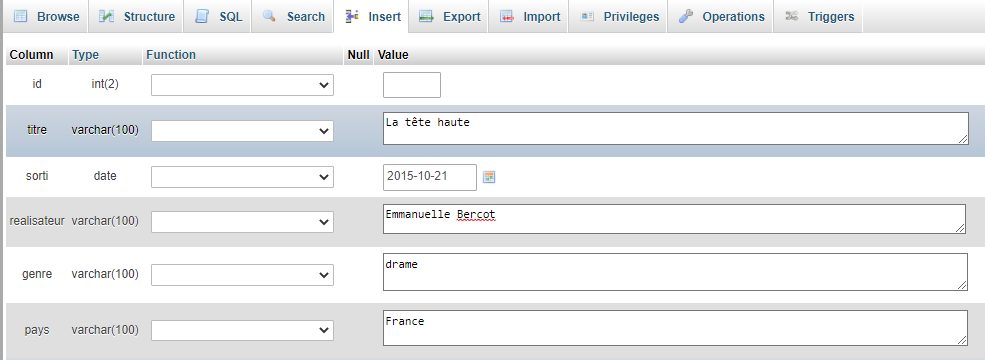
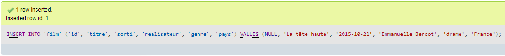
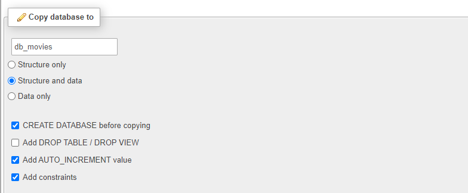

# Approche de la relation client/serveur

Tous les fichiers qui composent un site web doivent être placés sur serveur physique distant. C'est la phase d'hébergement.  
L'objectif est bien sûr que les internautes où qu'ils soient puissent avoir accès au contenu du site web.

Quand on veut accéder à un site web, on fait une demande depuis notre navigateur qui est considéré comme le _"client"_.  
Le serveur qui héberge le site web est configuré avec des logiciels qui permettent de gérer cette demande et offrir une réponse adaptée.

# Logiciels côté serveurs

Beaucoup de formules d'hébergement proposent encore aujourd"hui des configurations autour des technologies suivantes :

- serveur web HTTP **Apache** couplé avec le langage de script **PHP**.
- serveur **MySQL** _(System de Gestion de Base de Données)_

## Serveur HTTP Apache

Le serveur Apache est un logiciel dont le rôle est de gérer la communication entre le serveur et le client navigateur.  
Les échanges entre client et serveur web respectent un protocole de communication appelé HTTP _(Hypertext Transfert Protocol)_

> **NB**

- les urls commmencent par _http_ ou _https_.
- On parle de _"requête HTTP"_ et _"Reponse HTTP"_

## PHP

PHP est un langage de script qui permet côté serveur de construire du HTML avec du contenu dynamique.  
PHP peut communiquer avec des serveurs de base de données tels que **MySQL**..  
**A noter :** Le serveur Apache interprète le code PHP et renvoie au client du code HTML.

## MySQL

MySQL est un logiciel serveur qui permet d'organiser et traiter des données dans des tables relationnelles.  
Dans ce cours nous allons aborder la langage SQL avec la création d'une base de données :   
    1. avec seulement un table
    2. avec des tables relationnelles.
Ce cours n'utilisera qu'une partie des nombreuses fonctionnalités de MySQL.    
Toutefois il est possible de se référer à la doc officielles ou encore aux ressources telles que `https://sql.sh/`

## SQL 
- SQL `(Structured Query Language)` est un langage informatique qui permet de rechercher,  d'ajouter, de modifier ou de supprimer des données dans les bases de données relationnelles. 
- Les instructions du langage SQL sont très proches du langage humain, et plus précisément de la langue anglaise. L’idéal est de le découvrir par la pratique. 


# Installer un serveur en local.

Comme il est plus facile de développer en local, on nous propose des solutions _"trois en un"_ à installer sur notre ordinateur.

**Windows :**

- Wampserver : http://www.wampserver.com/

**Mac/Windows :**

- Xamp : https://www.apachefriends.org/fr/index.html
- Mamp : https://www.mamp.info/en/

# Apprendre à manipuler des database MySQL
## Interface PHPMyAdmin
- C'est un programme écrit en PHP qui propose de gérer vos action C.R.U.D. (create, read, update, delete) grâce à des formaulaires.
- C'est parfait pour commencer. 
## MySQLWorkbench
- C'est un des logiciels qui permettent de concevoir les bases de données à partir de diagrammes de classes.
- Ce genre d'outil est préférable pour des bases de données complexes et une approche plus professionnelle.

# Commencer avec PHPMyAdmin
## Présentation de l'interface
1. Créer une base de données
2. La sélectionner et créer une table.
3. Présentation des moteurs de stokage. _Il conditionne la performance des requêtes la fiabilité des relations entre tables, etc..._ 
4. Structure d’une table => similaires aux tableurs tels que Excel
## A retenir
- Colonnes et type de données 
- __Un enregistrement__ => Une rangée avec toutes les colonnes. 
- __Un champ__,  => c’est le croisement d’une colonne et d’un enregistrement de donnée. 
- __Une clé primaire__ => rend unique un enregistrement avec souvent un entier auto incrémenté 
- __Index unique__ => permet d'éviter d’insérer des doublons sur les données d’une colonne.  
- __Clés étrangères__ , => sont des index qui garantissent des relations solides entre les tables.


# Création d'une base de données avec table unique
## Structure
1. créer une base données `db_films`
2. créer une table `film` avec les champs _(id, titre, realisateur, genre, sorti, pays)_




3. La structure créée



## Insertion
1. Choisir quelques réalisateurs sur google : Exp : Bercot , tarantino, ...
2. Sélectionner insert dans le menu du haut




3. Une fois sauvegardé, PHPMyAdmin vous montre la requête sql exécutée.




4. Recommencer l'opération afin d'avoir une table de quelques films de 2 ou 3 réalisateurs de pays différents. 

# Dupliquer une database
1. Dans l'onglet de l'arboresence, cliquer sur `db_films`
2. Selectionner `operations` dans le menu du haut


- On nomme la base `db_movies`
- Cette copie va nous permettre de tester les opérations import/export

# Exporter/importer
- L'objectif est d'avoir une sauvegarde de toute la base de données ou de tables en particulier.
- On peut choisir de sauvegarder la structure et données ensemble ou indépendamment.
## Exporter la base de données db_movies
- choisir le mode quick
- un fichier `db_movies.sql` a été créé.
## Importer le fichier
- Détruire la base `db_movies` existante :  `Operations => Remove database => Drop the database`
- Créer à nouveau une base nommée `db_movies` et exécuter l'import de `db_movies.sql`
## Même opération avec une table
- cochez la table et cliquer sur le bouton drop.
- Cliquer sur import dans le menu du haut et sléectionner le fichier `film.sql`

# Requêtes de sélection.
1. ouvrir la fenetre SQL. C'est là que nous allons exécuter des requêtes.
2. Créez un fichier nommé `film_req_select.sql` afin de sauvegarder et commenter les requêtes suivantes.
```sql
--
-- Sélection ordonnée par rapport à un champ donné
-- NB : Chaque résultat donne une table en mémoire
--
SELECT * FROM films ORDER BY titre ASC; -- ou DESC
SELECT * FROM film ORDER BY genre ASC
--
-- Sélection selon un critère ou plusieurs critères	
--
SELECT titre, realisateur FROM film WHERE pays='Etats Unis'
SELECT * FROM film WHERE pays in ('France','Espagne')
--
-- Sélection des genre 
--  PB : la redondance, et une des raisons de modéliser une base de données avec des tables relationnelles
--
SELECT DISTINCT genre FROM film

--
-- Sélection des genre sans redondance
--
SELECT DISTINCT genre FROM film

--
-- Selection avec conversion en  minuscule du critère pays. 
--
SELECT * FROM film WHERE LCASE(pays) = 'etats unis'

--
-- Selection avec le critère realisateur dont la valeur contient . 
--
SELECT * FROM `film` WHERE realisateur LIKE "%tarant%"
```
## Requêtes de sélection par dates
```sql
--
-- Sélection à partir de l'année, du mois ou du jour
--
SELECT * FROM film WHERE YEAR(sorti) = 2015
SELECT * FROM film WHERE MONTH(sorti)=01

--
-- Sélection avec conversion en jour, mois, année.
--  NB : l'importance de l'alias (AS sorti) pour garder un nom champ valide
--
SELECT DATE_FORMAT( sorti,  '%d/%m/%Y' ) AS sorti FROM film

--
-- Selection avec séparation des jours,moi,année
--
SELECT DAY(sorti) AS jour, MONTH(sorti) AS mois, YEAR(sorti) AS annee FROM film
```
## Grouper par
```sql
--
-- Ci dessous on crée une table qui regroupe les pays et leurs occurrence dans la table
-- Le résultat donne une table en mémoire
-- 
SELECT pays, COUNT(pays) as nb FROM film GROUP BY pays
--
-- On peut maintenant l'utiliser comme table pour la requête complexe suivante
-- ici on récupère les pays qui n'ont qu'une seule occurence
--
select pays from (SELECT pays, COUNT(pays) as nb FROM film GROUP BY pays) as pays_seul WHERE nb=1

```
# Requêtes d'insertion
```sql
--
-- Insertion classique avec la liste des champs et le respect de l'ordre des champs pour les values
--
-- Insertion
INSERT INTO film (id,titre,realisateur,genre,sorti,pays)
VALUES (null,'Le Voyage de Chihiro','Hayao Miyazaki','animation','2002-04-10','Japon')

--
-- Insertions multiples
-- 
INSERT INTO film VALUES 
(null,'Leon','Luc Besson','action','1994-09-104','France'),
(null,'Le Cinquième Élément','Luc Besson','science fiction','1997-05-07','France')
```

# Requête de modification

```sql
--
-- Insérer un ernregistrement incomplet ou erroné puis
--
INSERT INTO film (id,titre,realisateur,genre,sorti,pays)
VALUES (null,'La prima cosa bella','Paolo Virzi','animation','2011-06-29','Japon')
--
-- Modifier 2 champs érronés
-- NB : ne pas oublier de préciser un critère pour cibler l'enregistrement concerné sinon tous auront cette modification
--
UPDATE film SET genre='comédie', pays='Italie' WHERE id=18
```

# Exercice 1 en classe 
- Créer une base de données d'une thématique de votre choix
- Utiliser des requêtes SQL pour insérer, sélectionner , mettre à jour , effacer
- Enregistrer chaque requête dans un fichier sql commenté.
- Exporter la base de données dans un autre fichier sql
- Placer les deux fichiers dans un dossier à votre nom_prenom
- zipper le dossier et envoyez le à l'adresse suivante `contact.seasone@gmail.com`

# Exercice 2 en classe
- Même principe avec une thématiques sur les animaux. 
- Exp : les félins : nom, race, pays, etc ...

- Requetes SQL sans l'interface.
- Que remarque t'on 