# A. Problèmes avec l'utilisation d'une table unique.
- Redondances des données
- Efficacité des requêtes
- Maintenance et la mise à jour.
#
# B. Les Tables relationnelles
## Principe
- Il s'avère plus efficace de ranger les données dans plusieurs tables et les relier entre elles.
- Dans l'exemple ci-dessous le schéma illustre le principe.
    - Pour chaque enregistrement de la table `Film`, on a un champ réservé à un index. Appelon le `genre_id `.
    - Chaque index doit correspondre  à la clé primaire d'un enregistrement de la table `Genre`.
    - __NB__ : (_Pour ce type de relation, on verra qu'il faut faire de cet index une clé `clé étrangère`_).

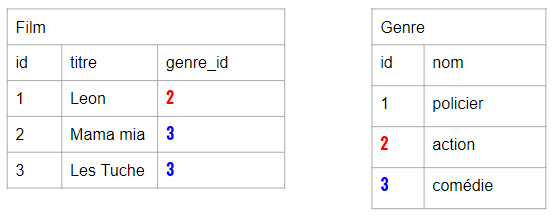

## Termes de relations :
- Un film ou plusieurs films appartiennent à un genre. On appelle cette relation `Many to One`
- Un genre peut se trouver dans un ou plusieurs films. On appelle cette relation `One to Many`

#
# C. Tables relationnelles de la base db_films 
- Définissons nos tables.
__nb:__ Majuscule, pas d'accents ni d'espaces.  
    - La table `Genre` avec les champs : `(id, nom)`
    - La table `Pays` avec les champs   `(id, nom)`
    - la table `Realisateur` avec les champs  `(id, nom)`
    - la table `Film` avec les champs `(id, titre, sorti, id_realisateur, id_pays, id_genre)`
    
## Création des tables
- On reprend notre base de données en commencant par les tables sans clé étrangère.
- Il n'est pas obligatoire de les alimenter à ce stade, mais on peut aussi le faire.
## La table Genre
Ici, la structure de la table Genre, pour l'exemple.

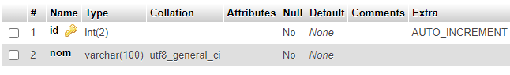 

__NB__ Faites de même pour les autres tables

## La table Film

En dernier, on crée la table film avec les champs qui vont pointer sur les clés primaires des autres tables _(clés étrangères)._

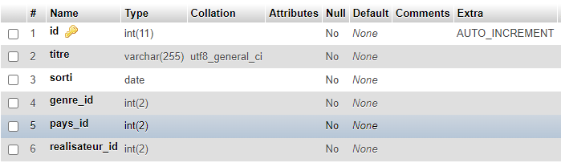

## Test d'insertion dans Film
Quand on fait un test d'insertion avec l'interface PHPMyAdmin, on voit rien de particulier qui nous montre quelque relation avec d'autres tables.

__Normal !__ Nous n'avons pas encore relié les champs `genre_id`, `realisateur_id`, `pays_id` avec les tables respectives.

## Vues relationnelles
Depuis l'onglet structure, nous voyons un bouton `relation view`, il ouvre une page formulaire laquelle nous permet  
de relier nos 2 tables.  

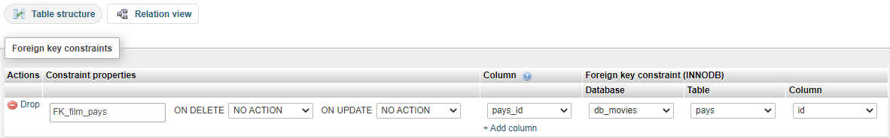

On constate maintenant sur la page de la structure  que notre champ `pays_id` est devenu un index.  
Regardez aussi la ligne plus bas, section : __indexes__ !

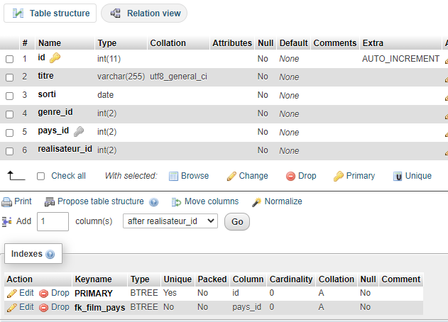 

Faites la même chose pour les autres champs index. On doit avoir comme résultat : 

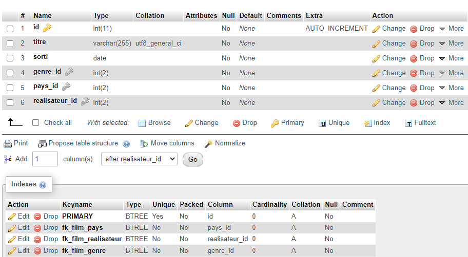 


## Insertion dans Pays
On insère deux pays pour vérifier la relation  

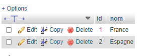

## Page d'insertion de Film maintenant.
Ouvrez le sélecteur du champ `pays_id `et constatez !  
On peut maintenant relier un pays à un film.  


## Insérer les données
Commencez par `Pays`, `Genre` et `Realisateur`, puis continuer avec `Film`

```sql
-- GENRE
INSERT INTO 
    genre (id,nom) 
VALUES 
    (null,'drame'), (null,'comédie'), (null,'western'), (null,'science fiction'), (null,'aventure'), (null,'animation')

-- PAYS
INSERT INTO 
    pays (id,nom) 
VALUES 
    (null,'Japon'), (null,'France'), (null,'Espagne'), (null,'Etats Unis') 

-- REALISATEUR  
INSERT INTO 
    realisateur (id, nom ) 
VALUES 
    (null, 'Emmanuelle Bercot'), (null,'Cédric Klapisch'), (null,'Quentin Tarantino'),
    (null,'Pedro Almodovar'),(null,'Georges Lucas'), (null,'Hayao Miyazaki');

-- FILM
-- A ce stade, il est plus simple de passer par l'interface.
```
#
# D. Sélections multi tables
Pour sélectionner de données qui se trouvent sur plusieurs tables, nous devons utiliser des requêtes avec de jointures qui font correspondre les clés étrangères avec des clé primaires.  

__NB__ IL existe plusieurs façons. Voyons cela dans une autre base de données.  
## Une base de test avec Deux tables
Créez une base de données `db_membres` avec la relation entre les deux
```bash
Table Membre (id, prenom,code_id)
Table Affectation (id, code)
```

Ce sera aussi l'occasion de voir une autre technique d'importation de données. 
### Format CSV
IL est possible de crééer le contenu à partir d'un tableur du type Excel.
### Importer depuis un fichier csv
`affectation.csv`

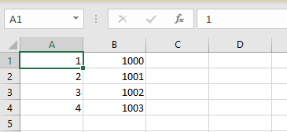  


`membre.csv`  

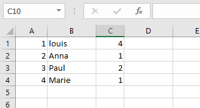


## Jointures et Différences de résultat
L'objectif est de récupérer les membres dont le code n'est pas nul.
### left join
```sql
 -- toutes les lignes de la table membre sont retournées, même s’il n’y a pas de correspondance dans la table affectation
SELECT 
    membres.prenom, affectation.code from membres 
    left join affectation on membres.code_id = affectation.id and affectation.code > 0
```
### inner join
```sql
 -- toutes les lignes de la table membres sont retournées, même s’il n’y a pas de correspondante dans la table affectation
SELECT 
    membres.prenom, affectation.code from membres 
    inner join affectation on membres.code_id = affectation.id and affectation.code > 0
```
## Sélection dans la base des films
### Selection avec jointure de 2 tables
```sql
SELECT F.titre,F.sorti, P.nom from film F
inner join pays P ON F.pays_id = P.id and P.nom = 'france' 
```
### Selection avec jointure 3 tables
```sql
SELECT 
	F.titre,
    F.sorti, 
    P.nom,
    R.nom 
from film F
inner join pays P ON F.pays_id = P.id 
inner join realisateur R ON F.realisateur_id = R.id 
and P.nom = 'france' 
```
# E. Exercice de groupe en classe
## Sujet
- Vous définissez la base de données du thème de votre choix
- Exemples de thèmes : _Musées, Capitales, Romans, Joueurs, albums, peintures, ..._
## Contraintes SQL
- Au moins deux tables reliées par des clé étrangères
## Type de rendu
- ici, pas de fichiers sql, mais un document pdf combinant une présentation et différentes phases de construction, relation et requêtes
### Comment faire ?
- Depuis PhpMyAdmin, il est possible d'imprimer en pdf structures, requêtes et résultats.  
- Exemple avec la table film. En dessous la liste des film, on trouve une série de liens, 
#### Premier __print__

#### deuxième __print__
- Pour enregistrer ay format pdf

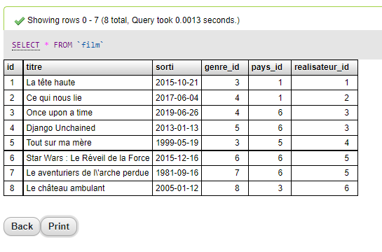

#### Exemple de SELECT
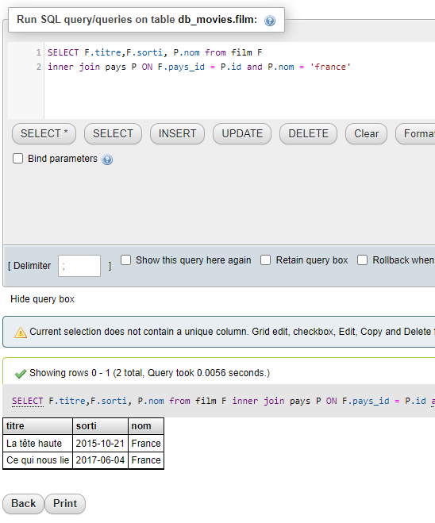
Cliquez sur le bouton print pour enregistrer le tout en pdf

